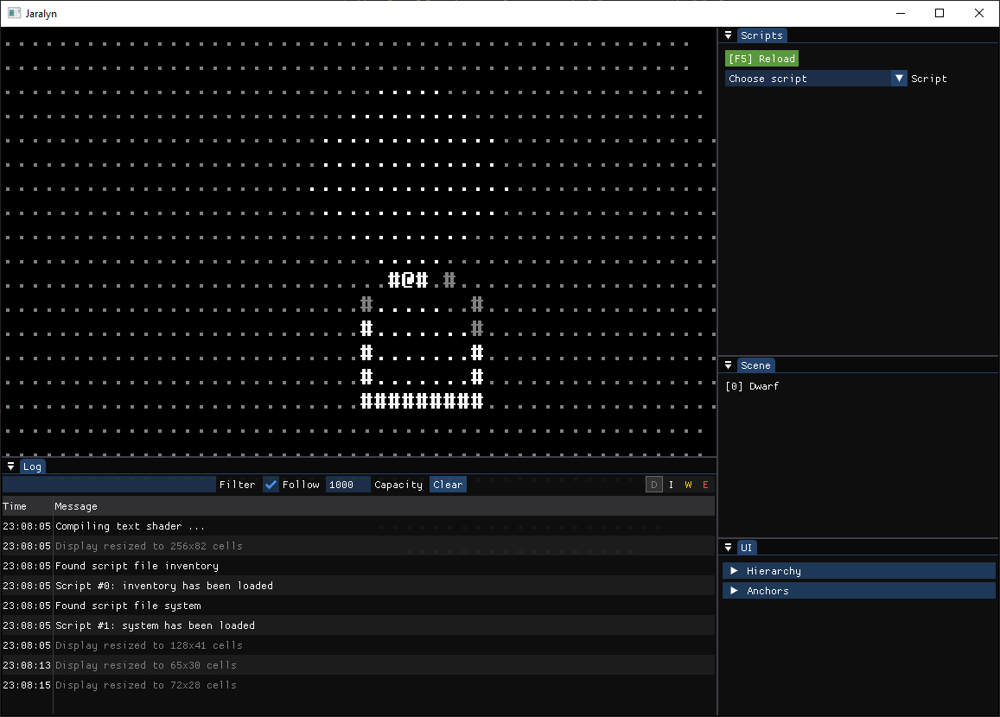

# Jaralyn

An early work in progress rogue-like inspired by Rogue, Dungeon Crawl and Dwarf Fortress. 
This is one of my learning projects where I try out different programming techniques or game design ideas.

I'm trying to minimise dependencies and if possible, they are shipping along with the source code.

This project requires a C++17 compatible compiler.
