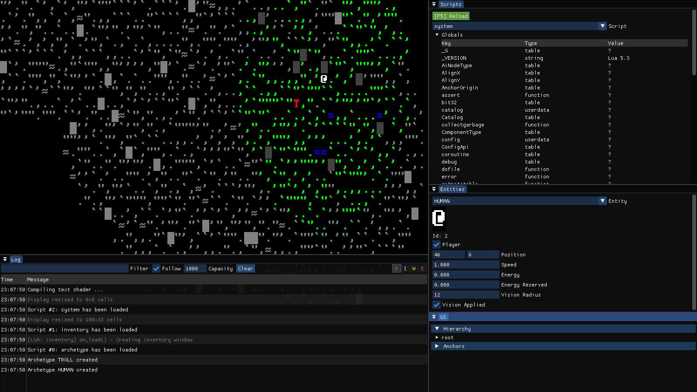

# NoEden

An early work in progress rogue-like survival game inspired by Rogue, Dungeon Crawl and Dwarf Fortress.

# Technical Details

* Language: C++
* Rendering: OpenGL
* Scripting: Lua
* Engine: Custom (currently being rewritten)
* Platform: Multiplatform

# Features

Still working on bootstrapping the engine and framework properly. But the following features are planned:

* 2D tile based rendering in classic ASCII style for a rich, text based experience
* procedural world generation with many biomes and creatures
* 3D map with ability to dig and build
* turn-based simluation 
* data driven game engine with Lua
* complex character creation and progression with multiple skills and attributes

# Libraries Used

* [ImGui](https://github.com/ocornut/imgui)
* [SDL2](https://www.libsdl.org/)
* [GLEW](https://glew.sourceforge.net/)
* [LuaBridge3](https://github.com/kunitoki/LuaBridge3)
* [tomlplusplus](https://github.com/marzer/tomlplusplus)
* [fmt](https://github.com/fmtlib/fmt)
* [stb_image](https://github.com/nothings/stb)
